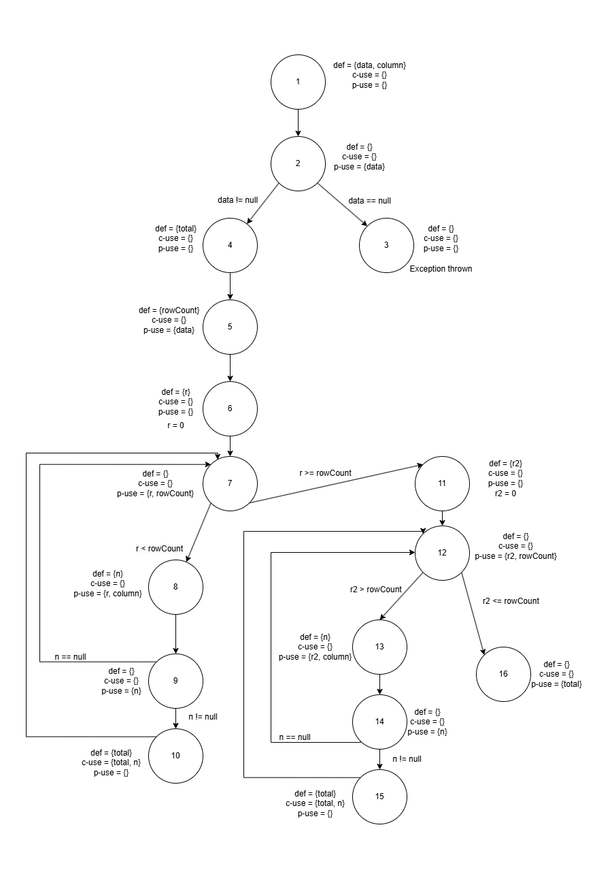
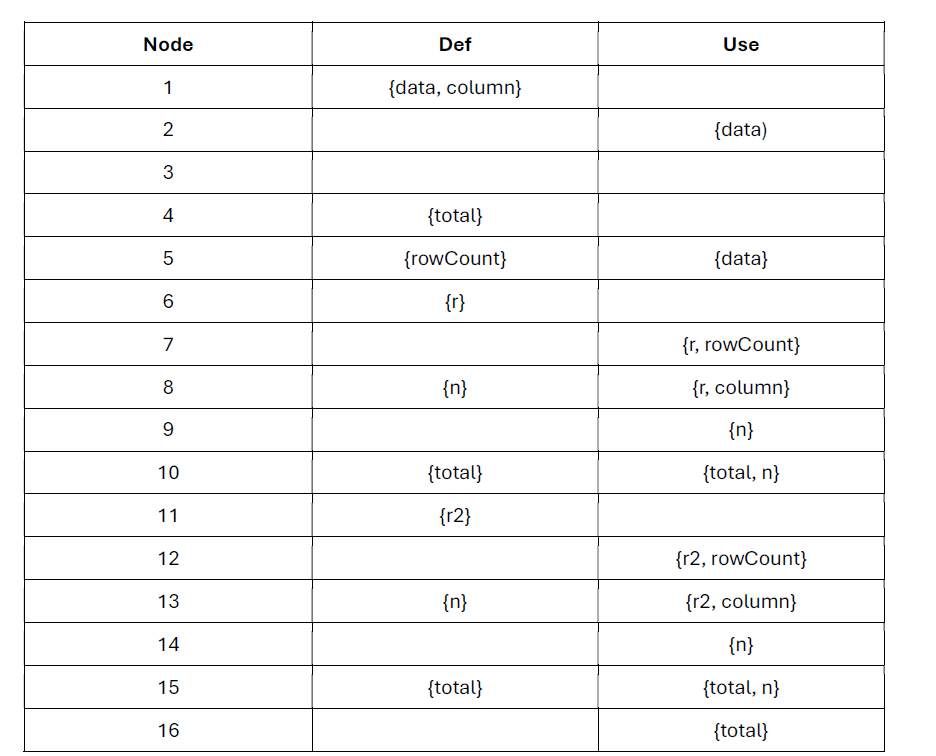
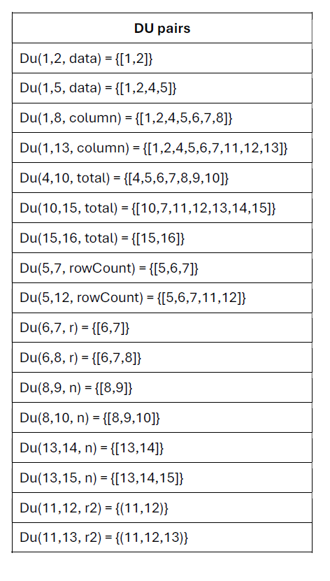
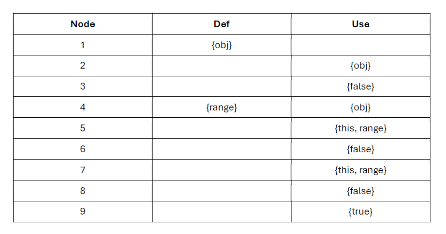
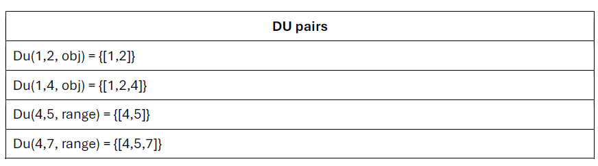
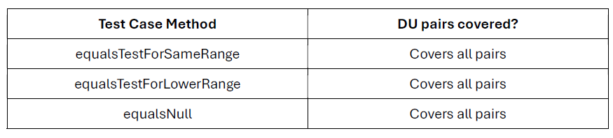

**SENG 438 - Software Testing, Reliability, and Quality**

**Lab. Report #3 – Code Coverage, Adequacy Criteria and Test Case Correlation**

| Group \#: 18     |     
| -------------- |
| Student Names: |     
|        Abdul Rafay        |    
|     Mohammed Azmath Khan|
|Taiwu Chen           |     
|       Hashir Naved         |     

(Note that some labs require individual reports while others require one report
for each group. Please see each lab document for details.)

# 1 Introduction

Text…

# 2 Manual data-flow coverage calculations for X and Y methods

## (1) DataUtilities.calculateColumnTotal (2 arguments)

### Data Flow Diagram

### Def-use sets per statement

### DU-pairs per variable

### Pairs covered in each test case
FILL THIS IN

### DU-pair coverage
FILL THIS IN

## (1) Range.equals 

### Data Flow Diagram
.png)

### Def-use sets per statement

### DU-pairs per variable

### Pairs covered in each test case

### DU-pair coverage
All Du-pairs are covered by each test case of Range.equals, thus the du-pair coverage is 100%.

# 3 A detailed description of the testing strategy for the new unit test

Text…

# 4 A high level description of five selected test cases you have designed using coverage information, and how they have increased code coverage

Text…

# 5 A detailed report of the coverage achieved of each class and method (a screen shot from the code cover results in green and red color would suffice)

Text…

# 6 Pros and Cons of coverage tools used and Metrics you report

Text…

# 7 A comparison on the advantages and disadvantages of requirements-based test generation and coverage-based test generation.

Text…

# 8 A discussion on how the team work/effort was divided and managed

Text…

# 9 Any difficulties encountered, challenges overcome, and lessons learned from performing the lab

The initial setup for the project took some time, as there were many external jars and instructions that had to be followed before anything would work. Getting familiar with the EclEmma tool also took a while. However, once everything was setup and the tools were familiarized, our team was able to get the work done swiftly.

# 10 Comments/feedback on the lab itself

The assignment was helpful for us to grow our knowledge on white box testing and coverage. It was cool to see how external tools and IDEs can vastly assist in the testing process for coverage.
