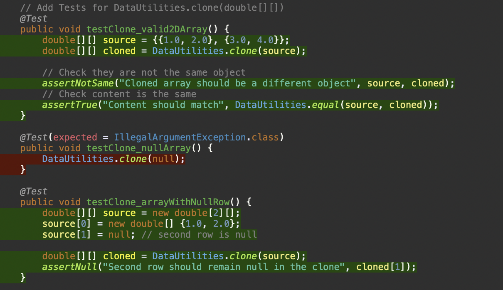

**SENG 438 - Software Testing, Reliability, and Quality**

**Lab. Report #3 – Code Coverage, Adequacy Criteria and Test Case Correlation**

| Group \#: 18     |     
| -------------- |
| Student Names: |     
|        Abdul Rafay        |    
|     Mohammed Azmath Khan|
|Taiwu Chen           |     
|       Hashir Naved         |     

# 1 Introduction

The purpose of this lab is to explore automated unit-testing and more specifically, the concept of white-box testing. Functions from the DataUtilities and Range classes are tested using a combination of unit tests and mock tests. This was accomplished by utilizing Java’s JUnit framework to develop these unit tests. In this lab, we also wanted to include as much statement coverage, decision coverage and method coverage as possible.

# 2 Manual data-flow coverage calculations for X and Y methods

## (1) DataUtilities.calculateColumnTotal (2 arguments)

### Data Flow Diagram

### Def-use sets per statement

### DU-pairs per variable

### Pairs covered in each test case

### DU-pair coverage
We calculate **DU-pair coverage** using the following formula:

DU Coverage = Number of Covered DU Pairs / Total DU Pairs * 100%

### Given Data:
- **Total DU Pairs:** **17**
- **Covered DU Pairs:** **15**
- **Uncovered DU Pairs:** **2** (both related to `r2` in an unreachable loop)

### Applying the Formula:
DU Coverage = 15/17 * 100% = 88.24%

## (2) Range.equals 

### Data Flow Diagram

### Def-use sets per statement

### DU-pairs per variable

### Pairs covered in each test case

### DU-pair coverage
All Du-pairs are covered by each test case of Range.equals, thus the du-pair coverage is 100%.

# 3 A detailed description of the testing strategy for the new unit test

We started our testing plan by evaluating test case adequacy criteria from Assignment 2 to check which ones matched statement while also validating branch and condition coverage requirements in this assignment. The evaluation revealed that most assessment methods from Assignment 2 already satisfied the coverage standards. Our testing goals received enhancement after we made plans to extend our tests to acquire better understanding. Our existing black-box tests combined with EclEmma allowed us to examine methods for identifying lines with incomplete coverage or no coverages at all. The process enabled us to develop new test cases which targeted uncovered areas thus improving both Assignment 2 test quality and coverage numbers. Our group decided to conduct an additional method test after feeling satisfied with our work so we developed fresh test cases to accumulate more testing experience.

The aim during black-box testing was to find boundary values and equivalence classes which created stronger method tests. We built our work from this basic framework to obtain total statement along with full branch and method testing. The test cases we designed specifically targeted different statements that appeared in multiple branch conditions to fulfill the requirements of the assignment. EclEmma enabled a graphical coverage display which helped us develop our tests by showing fully covered and partially covered and uncovered statements during the development process.

# 4 A high level description of five selected test cases you have designed using coverage information, and how they have increased code coverage

The new test case complements the existing one by covering the previously untested if (b0 <= this.lower) branch with an overlapping scenario. This increases branch coverage and ensures the intersects method correctly identifies intersections when the input range begins below the object’s lower bound but extends into it

The new test case ensures the constrain method correctly clamps values exceeding the upper bound, complementing the existing test for the lower bound. This improves the robustness of the code by validating both extremities of the range constraint logic, directly increasing branch coverage

The test cases for calculateColumnTotal and calculateRowTotal significantly improve coverage by ensuring that the methods correctly process a subset of rows or columns rather than iterating over all available data.

The tests for DataUtilities.clone(double[][]) ensure that both valid and exceptional cases are fully covered

The tests for DataUtilities.equal(double[][], double[][]) enhance code coverage by validating how the method compares 2D arrays under various conditions.

# 5 A detailed report of the coverage achieved of each class and method (a screen shot from the code cover results in green and red color would suffice)

## (1) Range Class/Methods

## (2) DataUtilities Class/Methods

# 6 Pros and Cons of coverage tools used and Metrics you report

| **Aspect**           | **Pros**                                                                                   | **Cons**                                                                                   |
|-----------------------|--------------------------------------------------------------------------------------------|--------------------------------------------------------------------------------------------|
| **EclEmma**          | Free, open-source, and integrates seamlessly with Eclipse. Visual code highlighting for coverage. Supports multiple metrics. | Doesn't support Conditional Coverage. Initially difficult to understand |
| **Statement Coverage** | Easy to measure and understand. Good for initial testing | Ignores decision logic. |
| **Branch Coverage**  | Tests different execution paths. Allows to validate all branches in the code. | Branches inside Boolean expressions are ignored. |
| **Conditional Coverage** | Ensures all Boolean conditions are tested. | Needs many test cases. EclEmma doesn’t explicitly support it, requiring manual review. |

# 7 A comparison on the advantages and disadvantages of requirements-based test generation and coverage-based test generation.

A main benefit of requirements-based testing is that it provides well-defined boundaries for testing which leads to better planning effectiveness. The number of test-defining requirements serves developers to produce a more precise time estimation for software testing duration. Developers can create tests more easily because they receive information about the explicitly defined requirements that appear during initial Waterfall project stages. Testers can obtain test coverage metrics through determining which tests correspond to their project requirements.

Requirements-based testing finds it difficult to identify essential components of overall software quality. The documentation standards in requirements often lack necessary details which prevents proper software design capture.

Testing with code coverage creates new test cases that extend the coverage of the codebase. This technique enables testers to discover parts of the program where existing test cases have no impact. Code coverage helps evaluate a numerical representation of code testing which functions as an indicator to assess application or product quality levels. A major disadvantage of code coverage based testing occurs when it evaluates written code for coverage instead of examining the intended functionality. The technique fails to provide information about the software aspects that remain unprogrammed. You might encounter difficulties in making direct tool-assessment comparisons because various systems could apply diverse measurement approaches to code coverage results.

# 8 A discussion on how the team work/effort was divided and managed

A member of our group displayed their screen on Zoom while the rest of us offered feedback to develop test cases. The four group members worked together to develop tests for Range and DataUtilities while distributing test cases evenly among themselves. Each group member created tests for three different methods to satisfy the minimum mandatory coverage requirements that include statements and branches and conditions. We collaborated by working on the specified coverage goals until reaching the target point then moved on to create the lab report.

The lab report divided into sections where each of the four members received assigned sections for completion. Each member was responsible for finishing their part prior to the group meeting to obtain approval from all members before the submission deadline. All members conducted a combined review of the final test cases followed by a collaborative edit process to integrate them. Group members carefully assessed each section of the lab report till all approved its content before sending it for submission to ensure high-quality collaborative work.

# 9 Any difficulties encountered, challenges overcome, and lessons learned from performing the lab

The initial setup for the project took some time, as there were many external jars and instructions that had to be followed before anything would work. Getting familiar with the EclEmma tool also took a while. However, once everything was setup and the tools were familiarized, our team was able to get the work done swiftly.

# 10 Comments/feedback on the lab itself

The assignment was helpful for us to grow our knowledge on white box testing and coverage. It was cool to see how external tools and IDEs can vastly assist in the testing process for coverage.
